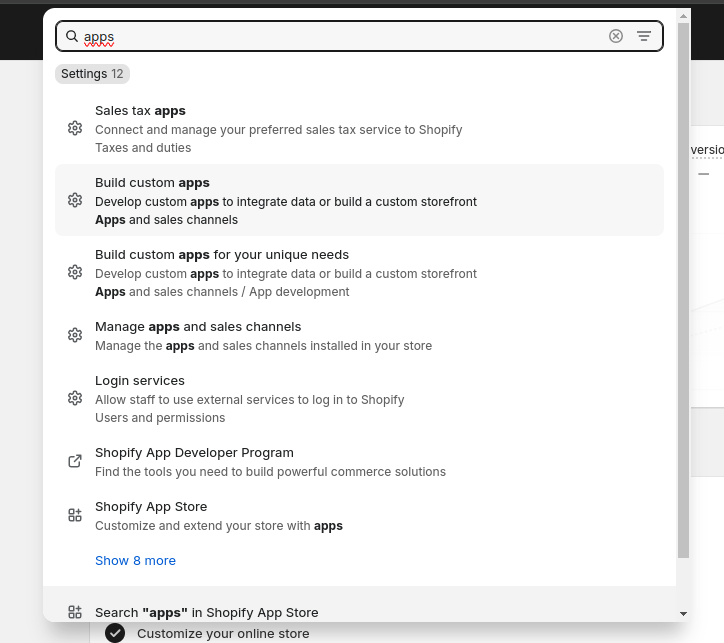
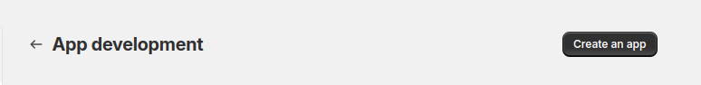

# SHOPIFY + NODEJS

## Como generar mis credenciales

1. Crea una aplicación en Shopify

Dirigete a tu administrador de tienda ingresando en el navegador https://admin.shopify.com/store/**nombre-de-tu-tienda**

2. Ingresa en el buscador _Apps_



y selecciona Build custom apps

3. Crea una nueva **app**



**Instala la aplicación creada** y guarda tus credenciales para acceder a tu tienda usando **NodeJs**

## Como conectar NodeJs con Shopify

1. Establece tus credenciales en un archivo .env para mantenerlas secretas

```
API_KEY="API_KEY"
SECRET_KEY="API_SECRET_KEY"
TOKEN="ADMIN_API_ACCESS_TOKEN"
SHOP_NAME="nombre-de-tu-tienda.myshopify.com"
PORT="PUERTO_DE_APLICACION"

```

2. Instala la siguiente libreria [@shopify/shopify-api](https://www.npmjs.com/package/@shopify/shopify-api)

3. Crea un objecto shopify

```TypeScript
export const shopify = shopifyApi({
    apiSecretKey: process.env.SECRET_KEY,
    apiVersion: ApiVersion.April24,
    apiKey: process.env.API_KEY,
    scopes: ['read_products,read_orders'],
    hostName: process.env.SHOP_NAME,
    adminApiAccessToken: process.env.TOKEN,
    isEmbeddedApp: false,
});
```
